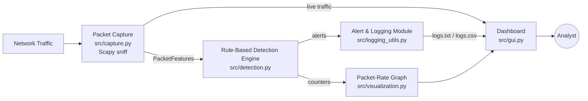

# Architecture

CyberWatch follows a linear pipeline: capture → extract → detect → alert → log,
with a Tkinter dashboard observing every stage.

## Module responsibilities

| Module | Responsibility |
|---|---|
| `src/capture.py` | Sniffs packets on a network interface (Scapy), filters out local/loopback traffic, extracts header fields only (source/destination IP, protocol, port, TCP flags) — no payload inspection, so it never touches application data. |
| `src/detection.py` | Pure, GUI-free rule engine. Tracks per-source-IP counters over a rolling `TIME_WINDOW` and raises an alert whenever a counter crosses its threshold. Fully unit-testable (see `tests/test_detection.py`). |
| `src/logging_utils.py` | Appends timestamped alerts to `logs/logs.txt` and can export them to `logs/logs.csv`. |
| `src/visualization.py` | Embeds a live Matplotlib packets/sec graph in a Tkinter `Toplevel` window using `FigureCanvasTkAgg`, refreshed via `root.after(...)` so it never blocks the GUI event loop. |
| `src/auth.py` | Simple login gate shown before the dashboard (demo-only, see [Security Notes](../README.md#security-notes)). |
| `src/gui.py` | Ties everything together: buttons (Start / Stop / Clear Logs / Graph / Export CSV), live log view, packet/alert counters, and the two background threads (`_calculate_rate_loop`, `_reset_counters_loop`). |
| `config.py` | Every tunable value (thresholds, time window, interface, credentials, paths) in one place. |

## Data flow per packet

1. `PacketCapture._handle_raw_packet` receives a raw Scapy packet, discards it if it has no `IP` layer or comes from a private/loopback prefix (`127.`, `192.168.`, `10.`), and builds a `PacketFeatures` value object.
2. `IntrusionDetector.process_packet` updates six counters (`packet_count`, `port_scan`, `syn_count`, `icmp_count`, `dns_count`, `connection_attempts`) and immediately calls `check_rules` for that source IP.
3. Any triggered rule returns a `"[ALERT] ..."` string, which the GUI both displays (highlighted red) and persists via `log_intrusion`.
4. Every `TIME_WINDOW` seconds (default 10s), a background thread clears all counters, which **re-arms** every rule for the next window — see [Known Issues](../README.md#known-issues-we-found-in-our-own-logs) for why that reset matters.

## Why the graph module was rewritten

The original prototype opened a Matplotlib figure inside the "Graph" button's callback using an infinite `while True: plt.pause(1)` loop. Because Tkinter callbacks execute on the same thread as `root.mainloop()`, that loop never returned — clicking "Graph" froze the whole dashboard. `PacketRateGraph` fixes this by embedding the figure with `FigureCanvasTkAgg` and rescheduling its own redraw with `window.after(...)`, which cooperates with the event loop instead of blocking it.
